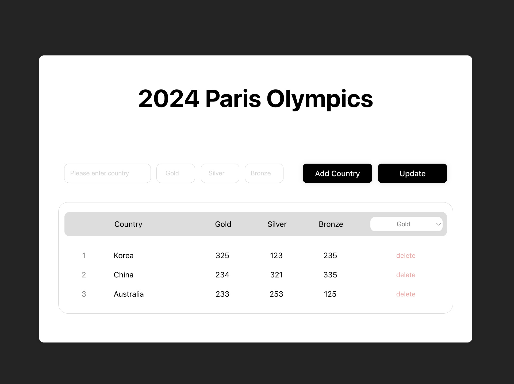

<!-- ####### 헤더 -->

# :trophy: 2024 Paris Olympics Medal List Page

2024년 파리 올림픽의 메달 순위를 업데이트하여, 각 국가별 금, 은, 동 메달 수를 확인할 수 있는 페이지입니다.

사용자는 필터 옵션을 통해 메달 종류(금, 은, 동)에 따라 국가 순위를 정렬할 수 있습니다.
 

 
 
 
 
 

<!-- ####### 프로젝트 소개 -->

<!-- 제목 -->

## :microphone: Project Introduction
 

<!-- 기간 -->

### :heavy_check_mark: **Development Period**
2025/01/21 ~ 2025/01/22

 
<!-- 테크 스택 -->

### :heavy_check_mark: **Tech Stack**

리액트 React를 사용하여 만들어진 프로젝트입니다.

 
 
 
 
 

<!-- ####### 프로젝트 특징 -->

<!-- 제목 -->

## :sparkles: Project Features
 

<!-- 특징 하나 -->

### :heavy_check_mark: **Local Storage**

local storage를 활용하여 새로고침 해도 정보가 유지되도록 했습니다.

> - 브라우저 종료 후 다시 접속해도 여전히 업데이트 했던 메달 수를 확인할 수 있습니다.
>
> - 나라의 정보를 삭제할 수 있습니다.

 

<!-- 특징 둘 -->

### :heavy_check_mark: **State**

React의 useState를 활용하여 실시간으로 정보가 바뀌도록 했습니다.

> - add country 버튼으로 나라의 정보를 곧바로 추가할 수 있습니다.
>
> - update 버튼을 통해 나라의 메달 수를 추가할 수 있습니다.
>
> - delete 버튼으로 정보를 삭제할 수 있습니다.
>
> - sort 기능을 통해 원하는 메달의 기준으로 나라를 정렬할 수 있습니다.

 
 
 
 
 

## :paperclip: Tech Blog Address

 

https://ijooha.tistory.com/

 
 
 
 
 

---
### :star2: Thanks for visiting **Judy's gitHub** ! :star2:

 
 
 
 
 
